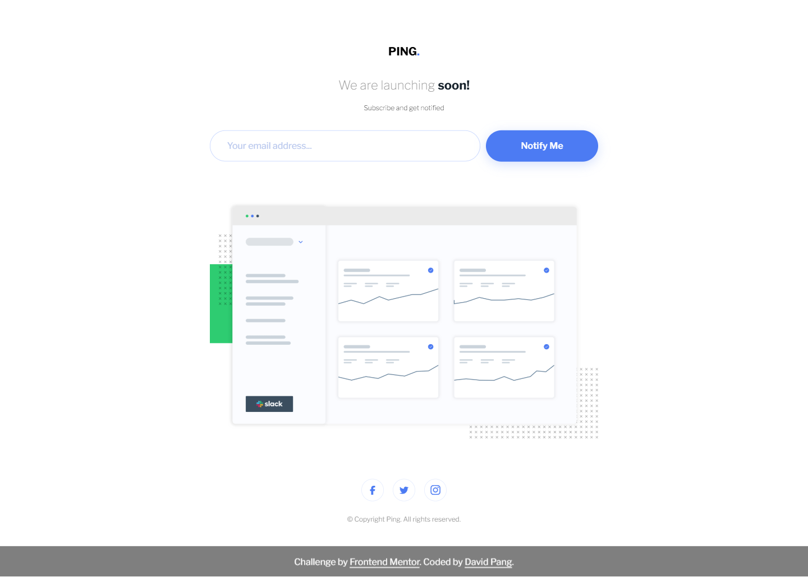

# Frontend Mentor - Ping coming soon page solution

This is a solution to the [Ping coming soon page challenge on Frontend Mentor](https://www.frontendmentor.io/challenges/ping-single-column-coming-soon-page-5cadd051fec04111f7b848da). Frontend Mentor challenges help you improve your coding skills by building realistic projects.

## Table of contents

-   [Overview](#overview)
    -   [Screenshot](#screenshot)
    -   [Links](#links)
-   [My process](#my-process)
    -   [Built with](#built-with)
    -   [What I learned](#what-i-learned)
    -   [Useful resources](#useful-resources)
-   [Author](#author)

## Overview

### Screenshot

#### Desktop

#### Mobile

### Links

-   Solution URL: [https://github.com/david-pang/frontend-mentor-ping-single-column-coming-soon/](https://github.com/david-pang/frontend-mentor-ping-single-column-coming-soon/)
-   Live Site URL: [https://david-pang.github.io/frontend-mentor-ping-single-column-coming-soon/](https://david-pang.github.io/frontend-mentor-ping-single-column-coming-soon/)

## My process

### Built with

-   Semantic HTML5 markup
-   Tailwind CSS
-   jQuery
-   jQuery Validation
-   Mobile-first workflow

### What I learned

This challenge allowed me to apply my Tailwind CSS and jQuery skills to a simple project.

### Useful resources

-   [Tailwind Docs](https://tailwindcss.com/docs) - The Tailwind docs provide the most up-to-date information on the Tailwind Features.
-   [jQuery Docs](https://learn.jquery.com/) - Learn the basics of jQuery and more.
-   [jQuery Validation Docs](https://jqueryvalidation.org/documentation/) - The jQuery Validation docs provides instructions on how to use and customise the plugin.

## Author

-   Frontend Mentor - [@david-pang](https://www.frontendmentor.io/profile/david-pang)
